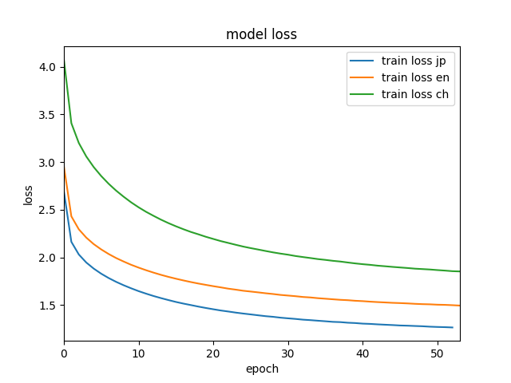
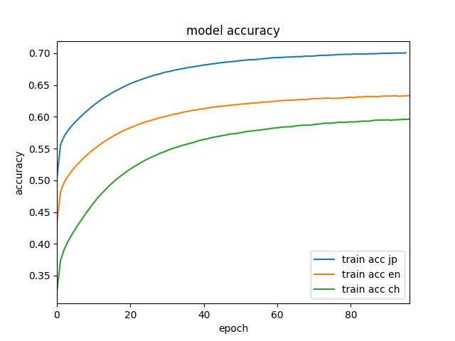

# Neural Image Caption Chainer
This repository contains Neural Image Caption implementation by Chainer using Japanese, English and Chinese captions.
Original paper is [Show and Tell: A Neural Image Caption Generator](https://arxiv.org/abs/1411.4555).

+ This implementation consists of two steps.
  - Image features extraction by CNN
  - Generate captions by RNN(LSTM) from extracted features

## Example

## Language Availability
- prepared languages in this repository are below this
    + English
    + Japanese
    + Chinese
- preparing
    + Korean
    + Cantonese

## Requirements

- main dependancies are below this.
 + python 3.6+
   - [Chainer 3.0.0+](https://github.com/chainer/chainer)
   - numpy 1.13.0+
   - flask 0.12.0+
   - openCV 3.3.0+

all requirement libralies can be installed below this.
you should use anaconda environment for this repository,
then execute command below
if you didn't setup CUDA environment, you should delete cupy==2.0.0 from requirements.txt

```
pip install -r requirements.txt
```

## Datasets

### Images
- [MSCOCO Images](http://cocodataset.org/)

### Captions
- English annotations: [MSCOCO Annotations](http://cocodataset.org/#download)
- Japanese annotations: [STAIR Captions](https://stair-lab-cit.github.io/STAIR-captions-web/)
- Chinese machine translated annotations: [mt-mscoco](https://github.com/apple2373/mt-mscoco)

## USAGE

### Download dataset.
firstly, you have to download some data using shells/download.sh
if you don't want to train MSCOCO image datasets by yourself, you just need pre-trained models.
```
sh shells/download.sh
```

### Dataset preparation

you alos have to process downloaded data.
if you process all language captions, you just need to execute below this
```
sh shells/process_dataset.sh
```

### extract features from images for yourself.
If you downloaded image features, you don't need to create features,
but if you want to create features for yourself, you just need execute the command below.

```
sh shells/create_features.sh
```

### Generate captions using pre-trained models

```
#if you don't use GPU set --gpu -1
#Generate Japanese captions
python src/CaptionGenerator.py \
--rnn_model_path data/models/rnn/STAIR_jp_256_Adam.model \
--cnn_model_path data/models/cnn/ResNet50.model \
--dict_path data/vocab_dict/dict_STAIR_jp_train.pkl \
--cnn_model_type ResNet \
--beamsize 3 \
--gpu 0 \
--img ../sample_img1.jpg

#Generate English captions
python src/CaptionGenerator.py \
--rnn_model_path data/models/rnn/MSCOCO_en_256_Adam.model \
--cnn_model_path data/models/cnn/ResNet50.model \
--dict_path data/vocab_dict/dict_MSCOCO_en_train.pkl \
--cnn_model_type ResNet \
--beamsize 3 \
--gpu 0 \
--img ../sample_img1.jpg

#Generate Chinese captions
python src/CaptionGenerator.py \
--rnn_model_path data/models/rnn/MSCOCO_ch_mt_256_Adam.model \
--cnn_model_path data/models/cnn/ResNet50.model \
--dict_path data/vocab_dict/dict_MSCOCO_ch_mt_train.pkl \
--cnn_model_type ResNet \
--beamsize 3 \
--gpu 0 \
--img ../sample_img1.jpg
```

### Generate captions as web app
Web application for generating captions of English, Japanese and Chinese.
You can start-up web application like this.

```
sh shells/app.sh
```
then, you just need to access to localhost:5000

### train dataset by yourself.
training examples are listed on shells/all_trains.sh.
if you want to run train/train_model.py with your won settings, you can check the options just by python train/train_model.py --h

#### For STAIR Japanese captions

```
sh shells/train_STAIR.sh
```

#### For MSCOCO English captions

```
sh shells/train_MSCOCO_en.sh
```

#### For MSCOCO Chinese translated captions

```
sh shells/train_MSCOCO_ch.sh
```

### train your own data
You just need to create json files that is exactly same form of MSCOCO caption datasets.

```
[{ "file_path": "path/to/img.jpg", "captions": ["caption1", 'caption2' ...]}, ...]
```

## Experiments
Training results of Japanese, English, Chinese captions.




## Next to do
-  experiments
-  prepare datas of multi languages using google cloud platfor api.
-  implement caption model using Bokete(create humor caption model)
-  add parser to create converted json file from your own data.

## Citations

```
@article{DBLP:journals/corr/XuBKCCSZB15,
  author    = {Kelvin Xu and
               Jimmy Ba and
               Ryan Kiros and
               Kyunghyun Cho and
               Aaron C. Courville and
               Ruslan Salakhutdinov and
               Richard S. Zemel and
               Yoshua Bengio},
  title     = {Show, Attend and Tell: Neural Image Caption Generation with Visual
               Attention},
  journal   = {CoRR},
  volume    = {abs/1502.03044},
  year      = {2015},
  url       = {http://arxiv.org/abs/1502.03044},
  archivePrefix = {arXiv},
  eprint    = {1502.03044},
  timestamp = {Wed, 07 Jun 2017 14:43:05 +0200},
  biburl    = {http://dblp.org/rec/bib/journals/corr/XuBKCCSZB15},
  bibsource = {dblp computer science bibliography, http://dblp.org}
}
```
